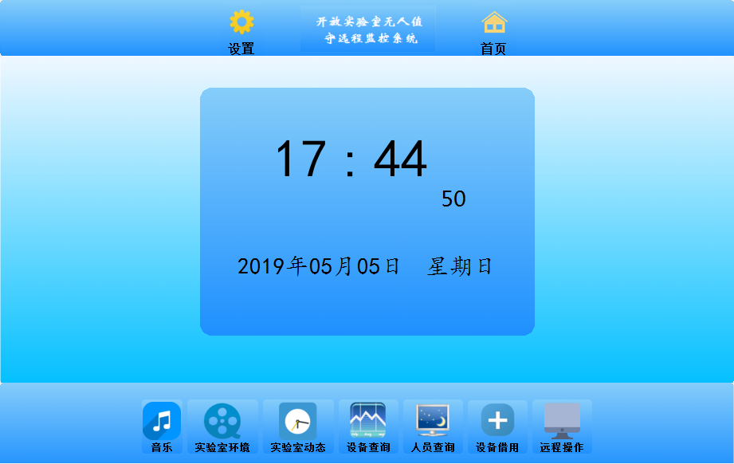
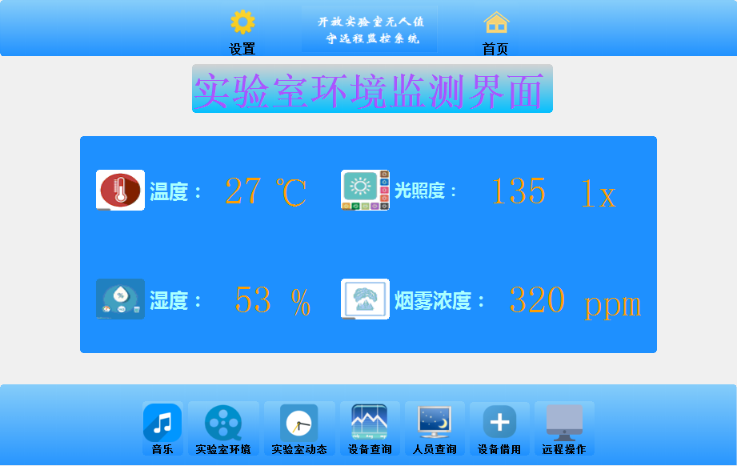
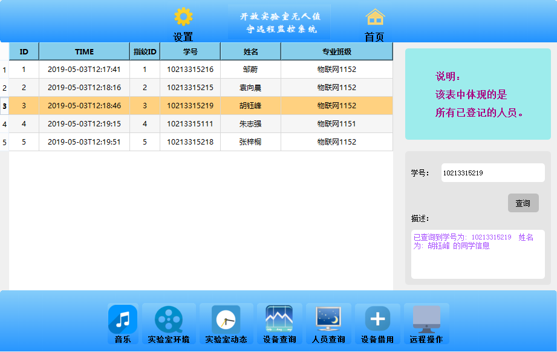
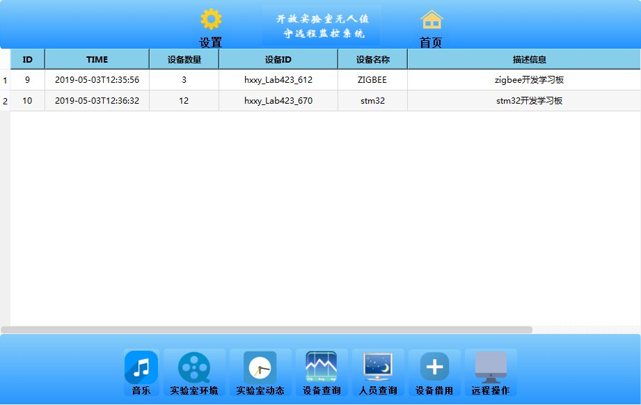
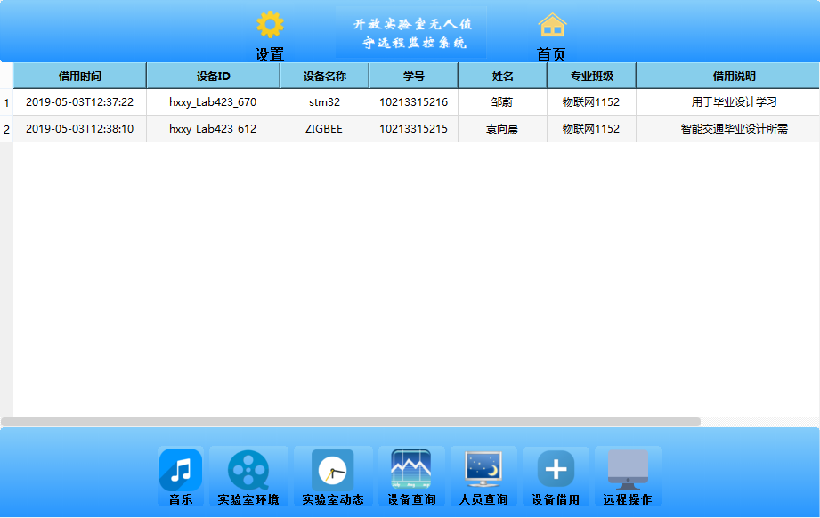
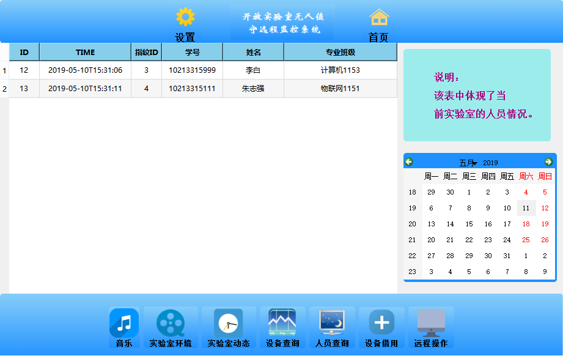
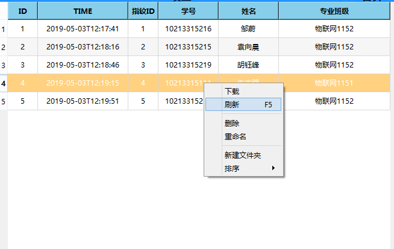
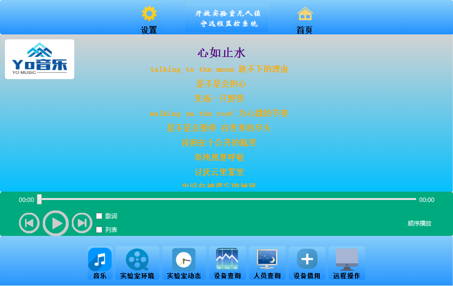
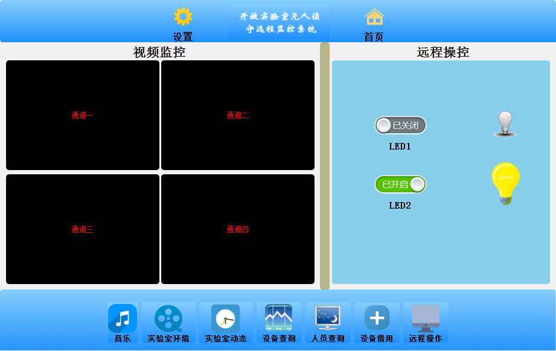

###  一、首页 ###

###  二、登录界面 ###

###  三、环境监测 ###

###  四、人员查询 ###

###  五、设备查询 ###

###  六、设备借用信息 ###

###  七、实验室人员动态情况 ###

### 八、表格刷新 ###

###  九、娱乐 ###

###  十、远程设备控制 ###

###  十一、账号注册 ###

###  十二、注册 ###

